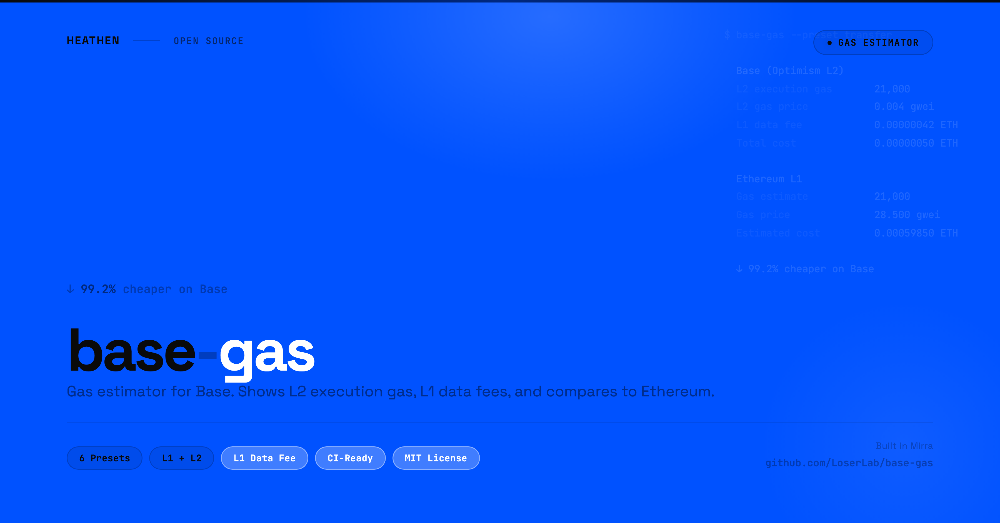

# base-gas

<p align="center">
  
</p>

Gas estimator for Base (OP Stack L2). Shows L2 execution gas, L1 data fees, and compares Base vs Ethereum costs.

Compares Base vs Ethereum costs for common transaction types. Queries the `GasPriceOracle` predeploy for accurate L1 data fee estimates.

## Install

```bash
npx base-gas
```

Or install globally:

```bash
npm install -g base-gas
base-gas
```

## Why this exists

Gas on Base (OP Stack) has a dual fee model that standard tools don't surface:

- **L2 execution fee**: The cost of running your transaction on Base. This is what `eth_estimateGas` returns, but it's only half the picture.
- **L1 data fee**: Every L2 transaction must be posted to Ethereum L1 as calldata. This fee fluctuates with Ethereum's base fee and can dominate the total cost for data-heavy transactions.
- **Total cost = L2 execution fee + L1 data fee**: Standard gas estimation only shows L2 gas. The L1 data fee is charged separately and depends on transaction size, not computation.
- **EIP-4844 blobs**: Since the Ecotone upgrade, Base posts data to L1 using blobs, significantly reducing L1 data fees. The GasPriceOracle predeploy at `0x420000000000000000000000000000000000000F` tracks the current L1 pricing.

`base-gas` queries both the L2 gas estimate and the L1 data fee from the GasPriceOracle, giving you the full cost breakdown.

## Usage

```bash
# Estimate all common transaction types
npx base-gas

# Estimate a specific preset
npx base-gas -p transfer
npx base-gas -p erc20-transfer
npx base-gas -p swap
npx base-gas -p nft-mint
npx base-gas -p deploy

# Custom transaction
npx base-gas --to 0x1234... --data 0xabcdef...

# JSON output (for CI/CD)
npx base-gas --json

# Include USD costs
npx base-gas --eth-price 2000

# Use testnet (Base Sepolia)
npx base-gas --testnet

# Skip Ethereum comparison
npx base-gas --no-compare
```

## Presets

| Preset | Description |
|---|---|
| `transfer` | ETH transfer (simple send) |
| `erc20-transfer` | ERC-20 token transfer |
| `erc20-approve` | ERC-20 token approval |
| `swap` | DEX swap (Uniswap-style) |
| `nft-mint` | NFT mint (ERC-721) |
| `deploy` | Contract deployment |

## Example Output

```
base-gas v0.1.0

ETH transfer (simple send)

  Base (OP Stack L2)
  L2 execution gas       21,000
  L2 gas price           0.004 gwei
  L2 execution fee       0.00000008 ETH
  L1 data fee            0.00000002 ETH
  Estimated cost         0.00000010 ETH
                         <$0.01

  Ethereum L1
  Gas estimate           21,000
  Gas price              28.500 gwei
  Estimated cost         0.00059850 ETH
                         $1.20

  ↓ 99.9% cheaper on Base (0.00059840 ETH saved)
```

## Exit Codes

| Code | Meaning |
|---|---|
| 0 | Estimation succeeded |
| 1 | Estimation failed |

## Programmatic API

```typescript
import { estimateGas, compareGas, buildPresetTx } from "base-gas";

// Estimate gas for a preset
const tx = buildPresetTx("transfer");
const estimate = await estimateGas(tx, {
  baseRpc: "https://mainnet.base.org",
});
console.log(estimate.l2Gas);            // 21000n
console.log(estimate.l1DataFee);        // L1 data fee in wei
console.log(estimate.estimatedCostEth); // "0.00000010"

// Compare Base vs Ethereum
const comparison = await compareGas(tx, {
  baseRpc: "https://mainnet.base.org",
  ethereumRpc: "https://ethereum-rpc.publicnode.com",
  ethPriceUsd: 2000,
});
console.log(comparison.savings?.percentage); // "99.9%"
```

## Part of the Base Developer Toolkit

| Tool | What it does |
|------|-------------|
| [base-audit](https://github.com/LoserLab/base-audit) | Catch EVM incompatibilities in your Solidity contracts for Base |
| **base-gas** (this tool) | Estimate gas costs on Base vs Ethereum |

**Recommended workflow:** `base-audit` (check contracts) -> `base-gas` (estimate costs) -> deploy on Base.

## Author

Created by [**Heathen**](https://x.com/heathenft)

Built in [Mirra](https://mirra.app)

## License

MIT License

Copyright (c) 2026 Heathen
